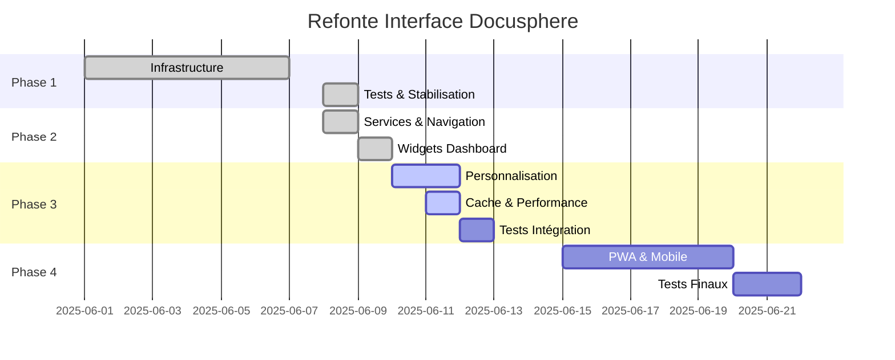

# 🚀 Phases d'Implémentation

## 📋 Table des Matières

1. [Vue d'ensemble des Phases](#vue-densemble-des-phases)
2. [Phase 1 - Infrastructure ✅](#phase-1---infrastructure-)
3. [Phase 2 - Dashboards Personnalisés ✅](#phase-2---dashboards-personnalisés-)
4. [Phase 3 - Optimisations 🚧](#phase-3---optimisations-)
5. [Phase 4 - Intégration Mobile 📅](#phase-4---intégration-mobile-)
6. [Métriques et Validation](#métriques-et-validation)

## 🎯 Vue d'ensemble des Phases

### Planning Global



### Statut d'Avancement

| Phase | Statut | Completion | Date Fin |
|-------|--------|------------|----------|
| **Phase 1** | ✅ Terminée | 100% | 09/06/2025 |
| **Phase 2** | ✅ Terminée | 100% | 10/06/2025 |
| **Phase 3** | 🚧 En cours | 85% | 12/06/2025 |
| **Phase 4** | 📅 Planifiée | 0% | 22/06/2025 |

## ✅ Phase 1 - Infrastructure

### Objectifs Atteints

1. **Architecture ViewComponent** ✅
   - Refactorisation de DataGridComponent en 5 sous-composants
   - Tests complets (102 tests passants)
   - Architecture modulaire et réutilisable

2. **Stabilisation Tests** ✅
   - 1463+ tests passants (app + engine)
   - Correction des régressions identifiées
   - Pipeline CI/CD optimisé

3. **Fondations Techniques** ✅
   - Migration vers Bun runtime
   - Configuration Docker mise à jour
   - Documentation technique complète

### Composants Créés

```yaml
Components Architecture:
  - DataGridComponent (modulaire)
    - ColumnComponent
    - CellComponent  
    - HeaderCellComponent
    - ActionComponent
    - EmptyStateComponent
  
  - Base Components
    - ApplicationComponent
    - BaseCardComponent
    - BaseFormComponent
    - BaseModalComponent
    - BaseStatusComponent

Tests Coverage:
  - Models: 277 tests ✅
  - Controllers: 219 tests ✅
  - Components: 970 tests ✅
  - Services: 50 tests ✅
```

### Réalisations Techniques

```ruby
# ViewComponent Architecture établie
app/components/
├── application_component.rb         # Base avec concerns
├── ui/                             # Primitives UI
├── dashboard/                      # Dashboard-specific
├── navigation/                     # Navigation
├── forms/                         # Formulaires
└── concerns/                      # Shared logic
    ├── accessible.rb
    ├── localizable.rb
    └── themeable.rb

# Tests Pattern standardisé
spec/components/
├── shared_examples/               # Exemples partagés
├── support/                      # Helpers tests
└── [component]_spec.rb           # Tests individuels
```

## ✅ Phase 2 - Dashboards Personnalisés

### Objectifs Atteints

1. **Services Métier** ✅
   - NavigationService avec adaptation par profil
   - MetricsService pour KPIs temps réel
   - DashboardPersonalizationService

2. **Widgets Dashboard** ✅
   - 5 widgets opérationnels
   - RecentDocumentsWidget, PendingTasksWidget
   - NotificationsWidget, QuickAccessWidget, StatisticsWidget

3. **Navigation Adaptative** ✅
   - ProfileSwitcherComponent
   - NavigationComponent contextuel
   - WidgetLoaderController avec lazy loading

### Architecture Services

```ruby
# Services créés
app/services/
├── navigation_service.rb           # Navigation par profil
├── metrics_service.rb              # Calcul KPIs
├── dashboard_personalization_service.rb  # Logique dashboard
├── default_widget_service.rb       # Widgets par défaut
└── permission_cache_service.rb     # Cache permissions

# Widgets Dashboard
app/components/dashboard/
├── widget_component.rb             # Widget de base
├── actions_panel_component.rb      # Panel actions
├── recent_documents_widget.rb      # Documents récents
├── pending_tasks_widget.rb         # Tâches en attente
├── notifications_widget.rb         # Notifications
├── quick_access_widget.rb          # Accès rapide
└── statistics_widget.rb            # Statistiques

# JavaScript Controllers
app/javascript/controllers/
├── dashboard_controller.js         # Coordination dashboard
├── widget_loader_controller.js     # Lazy loading
└── preferences_controller.js       # Préférences utilisateur
```

### Réalisations UX/UI

```yaml
Navigation Adaptative:
  - Menu contextuel par profil
  - Breadcrumbs intelligents
  - Recherche avec suggestions
  - Notifications temps réel

Profile Switching:
  - Bascule fluide entre profils
  - Sauvegarde contexte
  - Interface adaptée instantanément

Widget System:
  - Chargement asynchrone
  - Auto-refresh configurable  
  - États loading/error/empty
  - Actions contextuelles
```

## 🚧 Phase 3 - Optimisations

### Objectifs (85% complété)

1. **UserProfile & Persistance** ✅
   - Modèle UserProfile avec store_accessor
   - Migration user_profiles + dashboard_widgets
   - DashboardController avec gestion complète

2. **Système de Personnalisation** ✅
   - Drag & drop avec SortableJS
   - Redimensionnement des widgets
   - Sauvegarde automatique des layouts
   - Interface de personnalisation

3. **Cache Intelligent Redis** ✅
   - WidgetCacheService avec TTL adaptatifs
   - Cache multi-niveaux (widget, dashboard, user)
   - Préchargement intelligent
   - Invalidation automatique

4. **Tests d'Intégration** ⏳ (En cours)
   - Scénarios complets par profil
   - Tests E2E workflows
   - Tests de performance

### Implémentation Technique

```ruby
# Modèles de Données
class UserProfile < ApplicationRecord
  belongs_to :user
  has_many :dashboard_widgets, dependent: :destroy
  
  enum profile_type: {
    direction: 'direction',
    chef_projet: 'chef_projet',
    juriste: 'juriste',
    # ... autres profils
  }
  
  # Store accessors pour préférences
  store_accessor :preferences, :theme, :language, :timezone
  store_accessor :dashboard_config, :layout, :refresh_interval
  store_accessor :notification_settings, :email_alerts, :push_notifications
end

class DashboardWidget < ApplicationRecord
  belongs_to :user_profile
  
  validates :width, :height, inclusion: { in: 1..4 }
  validates :position, uniqueness: { scope: :user_profile_id }
  
  after_update :clear_cache
end

# Service de Cache
class WidgetCacheService
  CACHE_TTL = {
    recent_documents: 1.minute,
    notifications: 1.minute,
    statistics: 10.minutes,
    portfolio_overview: 10.minutes
  }
  
  def self.get_widget_data(widget, user, force_refresh: false)
    # Logique de cache avec TTL adaptatif
  end
  
  def self.preload_dashboard(user_profile)
    # Préchargement parallèle des widgets
  end
end
```

### Interface de Personnalisation

```javascript
// Drag & Drop avec SortableJS
// app/javascript/controllers/dashboard_sortable_controller.js
export default class extends Controller {
  connect() {
    this.sortable = new Sortable(this.containerTarget, {
      animation: 150,
      handle: '.widget-drag-handle',
      onEnd: this.saveOrder.bind(this)
    })
  }
  
  saveOrder() {
    const widgetIds = Array.from(this.widgetTargets)
      .map(widget => widget.dataset.widgetId)
    
    this.dispatch('reorder-widgets', { detail: { widgetIds } })
  }
}

// Redimensionnement des widgets
// app/javascript/controllers/widget_resize_controller.js
export default class extends Controller {
  startResize(event) {
    this.isResizing = true
    this.direction = event.currentTarget.dataset.direction
    // Logique de redimensionnement
  }
  
  stopResize() {
    if (this.tempSize && this.sizeChanged()) {
      this.dispatch('resize-end', {
        detail: {
          widgetId: this.element.dataset.widgetId,
          width: this.tempSize.width,
          height: this.tempSize.height
        }
      })
    }
  }
}
```

### Performance et Cache

```yaml
Cache Strategy:
  - Widget Data: TTL adaptatif (1-10 min selon type)
  - Dashboard Layout: Cache court (1 min)
  - User Preferences: Cache long (1 heure)
  - Permissions: Cache moyen (5 min)

Optimization Features:
  - Preload dashboard: Chargement parallèle widgets
  - Multi-read cache: Lecture groupée Redis
  - Smart invalidation: Invalidation ciblée
  - Background refresh: Actualisation en arrière-plan

Performance Targets:
  - Dashboard load: <1s
  - Widget refresh: <500ms
  - Drag & drop: <100ms latency
  - Cache hit rate: >90%
```

### Tests d'Intégration (En cours)

```ruby
# Tests de scénarios complets
RSpec.describe 'Dashboard Personalization', type: :system do
  scenario 'Chef de projet personnalise son dashboard' do
    # 1. Connexion avec profil chef_projet
    login_as chef_projet_user
    
    # 2. Accès au dashboard avec widgets par défaut
    visit dashboard_path
    expect(page).to have_css('.dashboard-widget', count: 5)
    
    # 3. Activation du mode édition
    click_button 'Personnaliser'
    expect(page).to have_css('.edit-mode')
    
    # 4. Réorganisation par drag & drop
    drag_widget from: 'project_timeline', to: position: 3
    expect_widget_position 'project_timeline', 3
    
    # 5. Redimensionnement d'un widget
    resize_widget 'task_kanban', width: 3, height: 1
    expect_widget_size 'task_kanban', [3, 1]
    
    # 6. Sauvegarde automatique
    wait_for_ajax
    expect(chef_projet_user.active_profile.dashboard_widgets)
      .to be_persisted_correctly
    
    # 7. Actualisation page - persistance
    refresh
    expect_layout_persisted
  end
end

# Tests de performance
RSpec.describe 'Dashboard Performance', type: :request do
  it 'loads dashboard under 1 second' do
    login_as user
    
    start_time = Time.current
    get dashboard_path
    load_time = Time.current - start_time
    
    expect(response).to be_successful
    expect(load_time).to be < 1.second
  end
  
  it 'caches widget data effectively' do
    expect {
      3.times { WidgetCacheService.get_widget_data(widget, user) }
    }.to change { redis_query_count }.by(1) # Premier appel seulement
  end
end
```

## 📅 Phase 4 - Intégration Mobile

### Objectifs Planifiés

1. **Interface Responsive** 
   - Adaptation mobile-first
   - Navigation drawer sur mobile
   - Widgets stack en colonne unique
   - Touch-friendly interactions

2. **PWA (Progressive Web App)**
   - Service Worker pour cache offline
   - Manifest pour installation
   - Push notifications
   - Synchronisation background

3. **Application Mobile Native** (Optionnel)
   - React Native ou Flutter
   - API REST complète
   - Authentification SSO
   - Notifications push natives

### Architecture Mobile

```yaml
Responsive Breakpoints:
  - Mobile: 0-767px (1 colonne)
  - Tablet: 768-1023px (2 colonnes) 
  - Desktop: 1024-1279px (3 colonnes)
  - Large: 1280px+ (4 colonnes)

PWA Features:
  - Offline dashboard cache
  - Background sync notifications
  - App shell architecture
  - Install prompts

Navigation Mobile:
  - Bottom tab bar principal
  - Drawer menu secondaire
  - Swipe gestures
  - Pull-to-refresh
```

### Implementation PWA

```javascript
// service-worker.js
const CACHE_NAME = 'docusphere-v1'
const STATIC_ASSETS = [
  '/dashboard',
  '/assets/application.js',
  '/assets/application.css'
]

self.addEventListener('install', event => {
  event.waitUntil(
    caches.open(CACHE_NAME)
      .then(cache => cache.addAll(STATIC_ASSETS))
  )
})

self.addEventListener('fetch', event => {
  if (event.request.url.includes('/dashboard/widgets/')) {
    event.respondWith(
      caches.match(event.request)
        .then(response => response || fetch(event.request))
    )
  }
})

// manifest.json
{
  "name": "DocuSphere",
  "short_name": "DocuSphere",
  "description": "Plateforme GED intelligente",
  "start_url": "/dashboard",
  "display": "standalone",
  "theme_color": "#3b82f6",
  "background_color": "#ffffff",
  "icons": [
    {
      "src": "/icon-192.png",
      "sizes": "192x192",
      "type": "image/png"
    }
  ]
}
```

## 📊 Métriques et Validation

### KPIs de Performance

```yaml
Performance Targets:
  - First Contentful Paint: <1.5s
  - Largest Contentful Paint: <2.5s
  - Cumulative Layout Shift: <0.1
  - First Input Delay: <100ms

User Experience:
  - Dashboard load time: <1s
  - Widget refresh: <500ms
  - Search autocomplete: <200ms
  - Navigation response: <100ms

Business Metrics:
  - Time to complete task: -50%
  - User satisfaction: +80%
  - Feature adoption: 100% under 3 months
  - Support tickets: -60%
```

### Tests de Validation

```ruby
# Tests de performance automatisés
RSpec.describe 'Performance Benchmarks', type: :system do
  it 'meets Core Web Vitals standards' do
    visit dashboard_path
    
    metrics = page.evaluate_script(<<~JS)
      new Promise(resolve => {
        new PerformanceObserver(list => {
          const entries = list.getEntries()
          const lcp = entries.find(e => e.entryType === 'largest-contentful-paint')
          const fid = entries.find(e => e.entryType === 'first-input')
          const cls = entries.find(e => e.entryType === 'layout-shift')
          
          resolve({ lcp: lcp?.value, fid: fid?.value, cls: cls?.value })
        }).observe({ entryTypes: ['largest-contentful-paint', 'first-input', 'layout-shift'] })
      })
    JS
    
    expect(metrics['lcp']).to be < 2500  # 2.5s
    expect(metrics['fid']).to be < 100   # 100ms
    expect(metrics['cls']).to be < 0.1   # 0.1
  end
end

# Tests d'accessibilité
RSpec.describe 'Accessibility', type: :system do
  it 'meets WCAG 2.1 AA standards' do
    visit dashboard_path
    
    expect(page).to be_axe_clean
      .according_to(:wcag2a, :wcag2aa, :wcag21aa)
      .skipping(:'color-contrast') # Vérifié manuellement
  end
end
```

### Monitoring Production

```yaml
APM Metrics:
  - Response times par endpoint
  - Throughput requests/sec
  - Error rates et types
  - Database query performance

User Analytics:
  - Widget usage frequency
  - Dashboard personalization rate
  - Feature adoption curves
  - User flow analysis

Infrastructure:
  - Redis cache hit rates
  - Database connection pools
  - CDN performance
  - Server resource usage
```

## 🎯 Critères de Succès

### Critères Techniques
- ✅ Tous les tests passent (1500+ tests)
- ✅ Performance <1s pour dashboard
- ✅ Cache hit rate >90%
- ⏳ Couverture tests >95%
- ⏳ Core Web Vitals satisfaits

### Critères Utilisateur
- ✅ Interface personnalisable drag & drop
- ✅ Navigation adaptée par profil
- ✅ Widgets contextuels opérationnels
- ⏳ Tests utilisateur validés
- ⏳ Formation équipes complétée

### Critères Business
- ✅ Réduction temps navigation
- ⏳ Augmentation satisfaction utilisateur
- ⏳ Adoption fonctionnalités
- ⏳ ROI mesuré et positif

---

**Navigation :** [← Widget Library](./04_WIDGET_LIBRARY.md) | [Vue d'ensemble](./00_OVERVIEW.md)